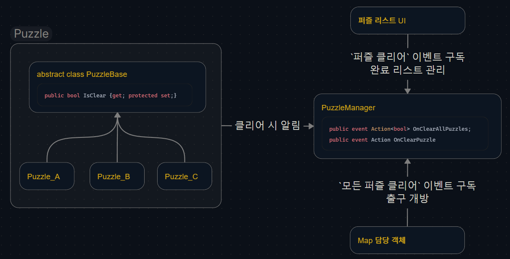

# 기술문서 - 퍼즐 클리어 판정

게임의 핵심 매커니즘인 퍼즐들이 클리어 되었는지를 판정하기 위한 기능입니다.
이 문서에서 세부 코드는 다루지 않으며, 어떤 구조로 설계되었는지를 다룹니다.

## 객체 설계

퍼즐들의 클리어 판정을 담당하는 객체는 `PuzzleManager`로 구현되었습니다.
싱글톤 패턴을 적용해 전역적인 가능이 접근하도록 하되, 생명 주기를 MainGame으로만 지정했습니다.

내부에는 퍼즐들을 관리하는 리스트를 가지고, 퍼즐이 클리어되면 `Puzzle -> PuzzleManager`로 메세지를 보낼 수 있도록 했습니다.

`PuzzleManager`는 메세지 수신 시 `OnClearPuzzle` 이벤트를 호출해 구독자들이 완료 리스트를 열람하고 갱신할 수 있도록 돕습니다. 
동시에 <mark>퍼즐이 모두 클리어 되었는지</mark> 판단하고, 모두 클리어 되어었다면 `OnClearAllPuzzles` 이벤트를 호출해 출구가 열릴 수 있도록 돕습니다.

## 관련 소스코드

- `Assets/Scripts/Core/PuzzleManager.cs`
- `Assets/Scripts/Core/PuzzleBase.cs`